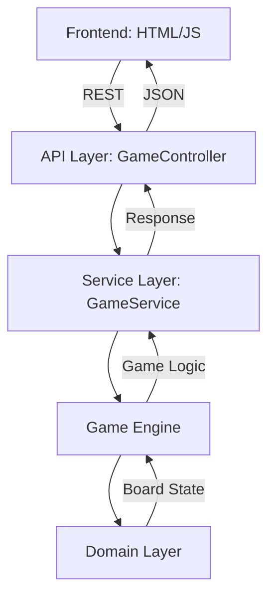

# Architecture Documentation

## Metadata
```yaml
last_updated: 2024-02-19
version: 1.1
status: implemented
primary_language: Kotlin
framework: Spring Boot
architecture_type: Two-tier
documentation_type: Theory of Implementation
```

## Document Purpose
This document describes the architectural design of the Tic Tac Toe application, providing a comprehensive overview of its structure, components, and implementation guidelines. It is specifically structured to facilitate AI understanding of the system architecture.

## System Overview
### Component Relationships


### Core Data Structures
```kotlin
enum class Player { X, O }

data class Position(val row: Int, val col: Int)

data class Move(
    val player: Player,
    val position: Position,
    val timestamp: Instant
)

data class GameState(
    val id: String,
    val board: Board,
    val status: GameStatus,
    val winner: Player?,
    val lastMove: Move?
)

enum class GameStatus {
    NEW,
    IN_PROGRESS,
    COMPLETED,
    ABANDONED
}
```

## Component Architecture
### 1. Domain Layer [IMPLEMENTED]
Location: `src/main/kotlin/us/planet10/ai/ttt/domain/`
```kotlin
interface Cell {
    val position: Position
    val player: Player?
}

interface Board {
    val cells: List<List<Cell>>
    val currentPlayer: Player
    val moveCount: Int
    
    fun makeMove(move: Move): Board
    fun isValidMove(move: Move): Boolean
    fun getWinner(): Player?
}

// Concrete implementation: GameBoard
data class GameBoard(
    override val cells: List<List<Cell>>,
    override val currentPlayer: Player,
    override val moveCount: Int
) : Board
```

Dependencies:
- None (core domain layer)

### 2. Game Engine [IMPLEMENTED]
Location: `src/main/kotlin/us/planet10/ai/ttt/engine/`
```kotlin
@Component
class GameEngine {
    fun createGame(id: String): GameState
    fun makeMove(gameState: GameState, position: Position): GameState
    fun generateAiMove(gameState: GameState): Position
    
    // Private implementation details
    private fun minimax(board: Board, depth: Int, isMaximizing: Boolean, 
                       originalPlayer: Player, alpha: Int, beta: Int): Int
    private fun evaluatePosition(board: Board, player: Player): Int
    private fun validateGameState(gameState: GameState)
    private fun determineGameStatus(board: Board, winner: Player?): GameStatus
}
```

Key Features:
- Minimax algorithm with alpha-beta pruning
- Position evaluation based on board control
- Configurable search depth (default: 6)
- Comprehensive move validation
- Game state management

Dependencies:
- Domain Layer (`Board.kt`, `GameState.kt`)

### 3. Service Layer [IMPLEMENTED]
Location: `src/main/kotlin/us/planet10/ai/ttt/service/`
```kotlin
@Service
class GameService(private val gameEngine: GameEngine) {
    private val games = ConcurrentHashMap<String, GameState>()
    
    fun createGame(): GameState
    fun getGame(gameId: String): GameState
    fun makeMove(gameId: String, position: Position): GameState
    fun makeAiMove(gameId: String): GameState
    fun abandonGame(gameId: String): GameState
    fun cleanupOldGames()
}
```

Key Features:
- Thread-safe game state management using ConcurrentHashMap
- Unique game ID generation
- Game lifecycle management
- Automatic cleanup of completed/abandoned games

Dependencies:
- Game Engine (`GameEngine.kt`)
- Domain Layer (via Game Engine)

### 4. API Layer [IMPLEMENTED]
Location: `src/main/kotlin/us/planet10/ai/ttt/api/`

REST Endpoints:
```yaml
POST /api/game:
  description: Create new game
  response: GameState

GET /api/game/{id}:
  description: Get game state
  response: GameState

POST /api/game/{id}/move:
  description: Make move
  request: MoveRequest
  response: GameState

POST /api/game/{id}/ai-move:
  description: Request AI move
  response: GameState

POST /api/game/{id}/abandon:
  description: Abandon game
  response: GameState
```

Key Features:
- Comprehensive error handling
- Swagger/OpenAPI documentation
- CORS configuration
- Response DTOs with proper schema documentation
- Global exception handler

Dependencies:
- Service Layer (`GameService.kt`)

### 5. Frontend [IMPLEMENTED]
Location: `src/main/resources/static/`

Component Structure:
```
frontend/
├── index.html     # Game board UI
├── styles.css     # Visual styling
└── game.js        # Game logic and API integration
```

Key Features:
- Object-oriented game management (TicTacToe class)
- Automatic game initialization
- Real-time board updates
- Move highlighting
- Game state management
- Error handling and user feedback
- Automatic game abandonment on page unload

## Implementation Guidelines
### 1. Code Organization
```
us.planet10.ai.ttt/
├── domain/       # Core entities and interfaces
│   ├── Board.kt
│   └── GameState.kt
├── engine/       # Game logic implementation
│   └── GameEngine.kt
├── service/      # Business logic and coordination
│   └── GameService.kt
├── api/          # REST endpoint controllers
│   └── GameController.kt
└── util/         # Shared utilities
    └── GameUtils.kt
```

### 2. Error Handling
```kotlin
// Controller-level error handling
@ExceptionHandler(Exception::class)
fun handleException(e: Exception): ResponseEntity<ErrorResponse> {
    val status = when (e) {
        is IllegalArgumentException -> HttpStatus.BAD_REQUEST
        is IllegalStateException -> HttpStatus.CONFLICT
        else -> HttpStatus.INTERNAL_SERVER_ERROR
    }
    return ResponseEntity.status(status).body(ErrorResponse(...))
}

// Service-level validation
fun getGame(gameId: String): GameState {
    return games[gameId] ?: throw IllegalArgumentException("Game not found: $gameId")
}

// Engine-level validation
private fun validateGameState(gameState: GameState) {
    when (gameState.status) {
        GameStatus.COMPLETED -> throw IllegalStateException("Game is already completed")
        GameStatus.ABANDONED -> throw IllegalStateException("Game has been abandoned")
        else -> {} // NEW and IN_PROGRESS are valid
    }
}
```

### 3. Testing Strategy
```kotlin
// Example test structure
class GameEngineTest {
    @Test
    fun `given empty board when valid move then updates board`()
    
    @Test
    fun `given in-progress game when winning move then updates status`()
    
    @Test
    fun `given invalid move when processed then throws error`()
}
```

## AI-Specific Implementation Notes
### 1. State Management
- All game state transitions are immutable
- State history is preserved for AI analysis
- Each state change is validated before application
- Thread-safe game state storage

### 2. Decision Points
- Move validation: `GameEngine.validateMove()`
- Win condition: `GameEngine.checkWinCondition()`
- AI move generation: `GameEngine.generateAiMove()`
- Game status determination: `GameEngine.determineGameStatus()`

### 3. Key Algorithms
```kotlin
// Minimax with alpha-beta pruning
private fun minimax(
    board: Board, 
    depth: Int, 
    isMaximizing: Boolean, 
    originalPlayer: Player,
    alpha: Int,
    beta: Int
): Int {
    // Terminal state checks
    val winner = board.getWinner()
    when {
        winner == originalPlayer -> return 10 - depth
        winner != null -> return -10 + depth
        board.moveCount == BOARD_SIZE * BOARD_SIZE -> return 0
        depth == MAX_DEPTH -> return evaluatePosition(board, originalPlayer)
    }

    // Recursive minimax with pruning
    if (isMaximizing) {
        var value = Int.MIN_VALUE
        var currentAlpha = alpha
        // ... pruning logic
    } else {
        var value = Int.MAX_VALUE
        var currentBeta = beta
        // ... pruning logic
    }
}
```

## Performance Considerations
### 1. Response Time Targets
- API Response: < 100ms
- AI Move Generation: < 1s (depth-limited)
- State Updates: < 50ms

### 2. Resource Usage
- Memory per Game: < 1MB
- AI Search Depth: 6 levels
- Concurrent Games: Thread-safe with ConcurrentHashMap
- Connection Pool: Spring Boot default

## Implementation Status
All components are fully implemented and functional:
- Domain Layer: Complete with all core entities
- Game Engine: Implemented with minimax AI
- Service Layer: Complete with thread-safe state management
- API Layer: All endpoints implemented with documentation
- Frontend: Complete with full game lifecycle support

## Task Tracking
See `project_tracking.md` for development progress and next steps.
