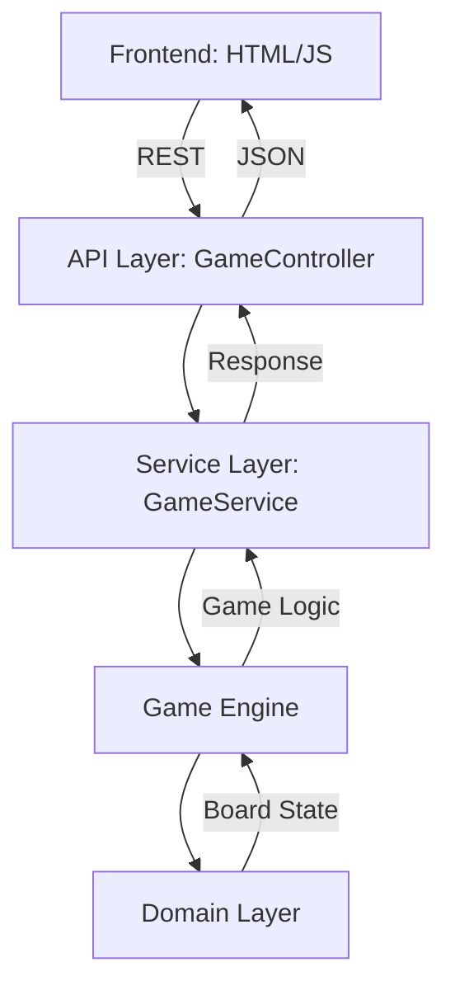

# Architecture Documentation

## Metadata
```yaml
last_updated: 2024-02-18
version: 1.0
status: implementation_phase
primary_language: Kotlin
framework: Spring Boot
architecture_type: Two-tier
documentation_type: Theory of Implementation
```

## Document Purpose
This document describes the architectural design of the Tic Tac Toe application, providing a comprehensive overview of its structure, components, and implementation guidelines. It is specifically structured to facilitate AI understanding of the system architecture.

## System Overview
### Component Relationships


### Core Data Structures
```kotlin
// Key domain interfaces and data classes
data class Position(val row: Int, val col: Int)
data class Move(val position: Position, val player: Player)
data class Board(val cells: List<List<Cell>>)
data class GameState(
    val id: String,
    val board: Board,
    val currentPlayer: Player,
    val status: GameStatus
)
```

## Component Architecture
### 1. Domain Layer [IMPLEMENTED]
Location: `src/main/kotlin/us/planet10/ai/ttt/domain/`
```kotlin
// Key interfaces
interface Cell {
    val position: Position
    val player: Player?
}

interface Board {
    fun makeMove(move: Move): Board
    fun isValidMove(move: Move): Boolean
    fun getWinner(): Player?
}
```

Dependencies:
- None (core domain layer)

### 2. Game Engine [IN PROGRESS]
Location: `src/main/kotlin/us/planet10/ai/ttt/engine/`
```kotlin
// Core interface
interface GameEngine {
    fun makeMove(gameState: GameState, move: Move): GameState
    fun validateMove(gameState: GameState, move: Move): Boolean
    fun checkWinCondition(board: Board): Player?
    fun generateAiMove(gameState: GameState): Move
}
```

Dependencies:
- Domain Layer (`Board.kt`, `GameState.kt`)

### 3. Service Layer [PENDING]
Location: `src/main/kotlin/us/planet10/ai/ttt/service/`
```kotlin
// Service interface
interface GameService {
    fun createGame(): GameState
    fun processMove(gameId: String, move: Move): GameState
    fun requestAiMove(gameId: String): Move
}
```

Dependencies:
- Game Engine (`GameEngine.kt`)
- Domain Layer (via Game Engine)

### 4. API Layer [PENDING]
Location: `src/main/kotlin/us/planet10/ai/ttt/api/`

REST Endpoints:
```yaml
POST /api/game:
  description: Create new game
  response: GameState

GET /api/game/{id}:
  description: Get game state
  response: GameState

POST /api/game/{id}/move:
  description: Make move
  request: Move
  response: GameState

GET /api/game/{id}/ai-move:
  description: Request AI move
  response: Move
```

Dependencies:
- Service Layer (`GameService.kt`)

### 5. Frontend [NOT STARTED]
Location: `src/main/resources/static/`

Component Structure:
```
frontend/
├── index.html     # Game board UI
├── styles.css     # Visual styling
└── game.js        # Game logic and API integration
```

## Implementation Guidelines
### 1. Code Organization
```
us.planet10.ai.ttt/
├── domain/       # Core entities and interfaces
│   ├── Board.kt
│   └── GameState.kt
├── engine/       # Game logic implementation
│   └── GameEngine.kt
├── service/      # Business logic and coordination
│   └── GameService.kt
├── api/          # REST endpoint controllers
│   └── GameController.kt
└── util/         # Shared utilities
    └── GameUtils.kt
```

### 2. Error Handling
```kotlin
// Error hierarchy
sealed class GameError : RuntimeException {
    data class InvalidMove(val reason: String) : GameError()
    data class GameNotFound(val gameId: String) : GameError()
    data class IllegalGameState(val state: GameState) : GameError()
}

// Error response format
data class ErrorResponse(
    val code: String,
    val message: String,
    val details: Map<String, Any>? = null
)
```

### 3. Testing Strategy
```kotlin
// Example test structure
class GameEngineTest {
    @Test
    fun `given empty board when valid move then updates board`()
    
    @Test
    fun `given in-progress game when winning move then updates status`()
    
    @Test
    fun `given invalid move when processed then throws error`()
}
```

## AI-Specific Implementation Notes
### 1. State Management
- All game state transitions are immutable
- State history is preserved for AI analysis
- Each state change is validated before application

### 2. Decision Points
- Move validation: `GameEngine.validateMove()`
- Win condition: `GameEngine.checkWinCondition()`
- AI move generation: `GameEngine.generateAiMove()`

### 3. Key Algorithms
```kotlin
// Minimax algorithm structure
fun minimax(board: Board, depth: Int, isMax: Boolean): Int {
    if (isTerminal(board) || depth == 0) {
        return evaluate(board)
    }
    
    return if (isMax) {
        generateMoves(board).maxOf { move ->
            minimax(makeMove(board, move), depth - 1, false)
        }
    } else {
        generateMoves(board).minOf { move ->
            minimax(makeMove(board, move), depth - 1, true)
        }
    }
}
```

## Performance Considerations
### 1. Response Time Targets
- API Response: < 100ms
- AI Move Generation: < 1s
- State Updates: < 50ms

### 2. Resource Usage
- Memory per Game: < 1MB
- AI Search Depth: Configurable (3-7)
- Connection Pool Size: 10

## Implementation Status
See `implementation_state.md` for detailed current development status.

## Task Tracking
See `project_tracking.md` for development progress and next steps.
