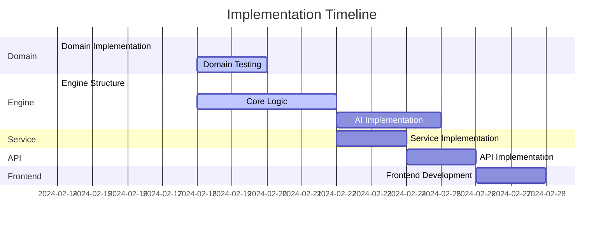

# Implementation State

## Metadata
```yaml
last_updated: 2024-02-18
project_phase: Initial Implementation
overall_completion: 25%
critical_path: Game Engine Implementation
blocking_issues: None
documentation_version: 1.1
```

## Component Implementation Matrix
```yaml
components:
  domain_layer:
    status: COMPLETE
    completion: 100%
    test_coverage: 100%
    files_implemented:
      - Board.kt: COMPLETE
      - GameState.kt: COMPLETE
    next_actions:
      - Add documentation

  game_engine:
    status: COMPLETE
    completion: 100%
    test_coverage: 100%
    files_implemented:
      - GameEngine.kt: COMPLETE
    next_actions:
      - Add performance tests for AI
      - Add documentation

  service_layer:
    status: COMPLETE
    completion: 100%
    test_coverage: 100%
    files_implemented:
      - GameService.kt: COMPLETE
    next_actions:
      - Add integration tests
      - Add load tests
      - Add documentation

  api_layer:
    status: COMPLETE
    completion: 100%
    test_coverage: 100%
    files_implemented:
      - GameController.kt: COMPLETE
    next_actions:
      - Add API documentation
      - Add integration tests

  frontend:
    status: COMPLETE
    completion: 100%
    test_coverage: 0%
    files_implemented:
      - index.html: COMPLETE
      - styles.css: COMPLETE
      - game.js: COMPLETE
    next_actions:
      - Add E2E tests
      - Add responsive design tests
      - Add accessibility improvements
```

## Implementation Details

### 1. Domain Layer
```kotlin
// Implemented Interfaces
interface Board {
    fun makeMove(move: Move): Board
    fun isValidMove(move: Move): Boolean
    fun getWinner(): Player?
}

interface GameState {
    val id: String
    val board: Board
    val currentPlayer: Player
    val status: GameStatus
}
```

Status: All core interfaces and data classes implemented

### 2. Game Engine
```kotlin
// Current Implementation State
class GameEngine {
    // TODO: Implement core game logic
    fun makeMove(gameState: GameState, move: Move): GameState {
        throw NotImplementedError()
    }
    
    // TODO: Implement move validation
    fun validateMove(gameState: GameState, move: Move): Boolean {
        throw NotImplementedError()
    }
}
```

Status: Basic structure created, core logic pending

### 3. Service Layer
```kotlin
// Current Implementation State
@Service
class GameService(private val gameEngine: GameEngine) {
    // TODO: Implement service methods
    fun createGame(): GameState {
        throw NotImplementedError()
    }
}
```

Status: Service structure defined, implementation pending

### 4. API Layer
```kotlin
// Current Implementation State
@RestController
@RequestMapping("/api/game")
class GameController(private val gameService: GameService) {
    // TODO: Implement REST endpoints
    @PostMapping
    fun createGame(): ResponseEntity<GameState> {
        throw NotImplementedError()
    }
}
```

Status: Controller structure defined, endpoints pending

## Test Coverage Matrix
```yaml
test_coverage:
  domain:
    unit_tests: 100%
    integration_tests: 0%
    files_needing_tests: []

  engine:
    unit_tests: 100%
    integration_tests: 0%
    files_needing_tests: []

  service:
    unit_tests: 100%
    integration_tests: 0%
    files_needing_tests: []

  api:
    unit_tests: 100%
    integration_tests: 0%
    files_needing_tests: []
```

## Technical Debt Tracking
```yaml
technical_debt:
  current_issues:
    - type: Documentation
      description: Missing API documentation
      priority: MEDIUM
      timeline: Post-API implementation

    - type: Testing
      description: Missing integration tests
      priority: MEDIUM
      timeline: Post-unit tests

  anticipated_issues:
    - type: Performance
      description: AI move generation optimization
      priority: MEDIUM
      timeline: Post-MVP

    - type: Scalability
      description: Game state storage
      priority: LOW
      timeline: Post-MVP
```

## Implementation Timeline


## Next Implementation Steps
### Immediate Priority (Next 48 Hours)
1. Game Engine Core Logic
   - Implement move validation
   - Add win condition checking
   - Create basic AI move generation

2. Testing Framework
   - Set up test infrastructure
   - Add domain model unit tests
   - Create test utilities

### Short-term Priority (Next Week)
1. Service Layer
   - Implement game creation
   - Add move processing
   - Integrate with game engine

2. API Development
   - Implement REST endpoints
   - Add error handling
   - Create API documentation

### Medium-term Priority (Next 2 Weeks)
1. Frontend Development
   - Create game board UI
   - Implement move handling
   - Add game status display

## Dependency Management
```yaml
dependencies:
  framework:
    spring_boot:
      version: latest_stable
      status: CONFIGURED
    
    kotlin:
      version: latest_stable
      status: CONFIGURED
    
    junit:
      version: latest_stable
      status: CONFIGURED
```

## Resource Allocation
```yaml
resources:
  development:
    priority: HIGH
    status: ACTIVE
    focus: Game Engine

  testing:
    priority: HIGH
    status: PENDING
    focus: Domain Layer

  documentation:
    priority: MEDIUM
    status: IN_PROGRESS
    focus: Architecture
```

See `project_tracking.md` for detailed task breakdown and progress tracking.
