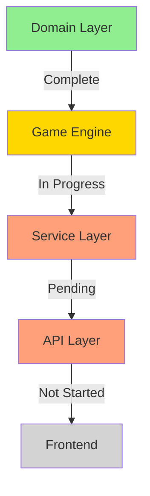
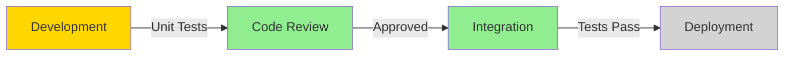
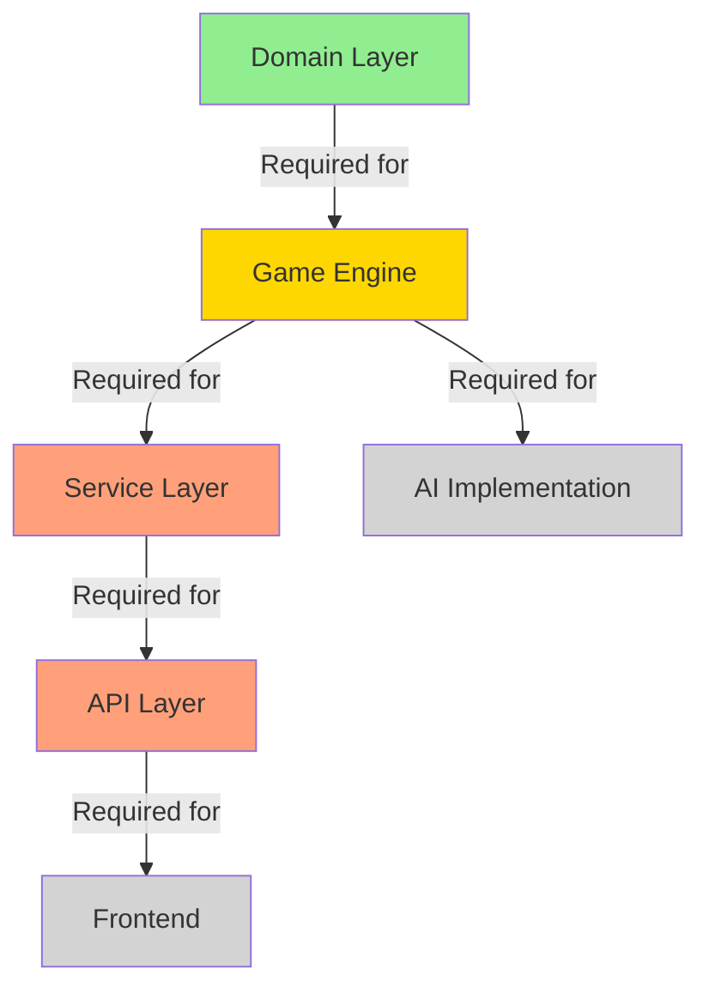

# Project Tracking

## Metadata
```yaml
last_updated: 2024-02-18
sprint: Initial Implementation
sprint_goal: Core Game Engine
sprint_end: 2024-02-25
overall_progress: 25%
critical_tasks:
  - Game Engine Implementation
  - Move Validation
  - Win Detection
documentation_version: 1.1
```

## Task Board
```yaml
backlog:
  high_priority:
    - id: TEST-1
      title: Domain Layer Testing
      status: TODO
      owner: TBD
      estimate: 2 days
      dependencies: []
      subtasks:
        - Test Framework Setup [TODO]
        - Board Tests [TODO]
        - GameState Tests [TODO]
        - Test Coverage Reports [TODO]

    - id: TEST-2
      title: Game Engine Testing
      status: TODO
      owner: TBD
      estimate: 3 days
      dependencies: []
      subtasks:
        - Core Logic Tests [TODO]
        - AI Performance Tests [TODO]
        - Edge Case Tests [TODO]
        - Test Coverage Reports [TODO]

  medium_priority:
    - id: TEST-3
      title: Integration Testing
      status: TODO
      owner: TBD
      estimate: 3 days
      dependencies: [TEST-1, TEST-2]
      subtasks:
        - Service Layer Tests [TODO]
        - API Layer Tests [TODO]
        - End-to-End Tests [TODO]
        - Load Tests [TODO]

    - id: DOC-1
      title: API Documentation
      status: TODO
      owner: TBD
      estimate: 2 days
      dependencies: []
      subtasks:
        - OpenAPI Specification [TODO]
        - API Usage Guide [TODO]
        - Error Handling Guide [TODO]
        - Example Requests/Responses [TODO]

  low_priority:
    - id: UI-2
      title: Frontend Improvements
      status: TODO
      owner: TBD
      estimate: 3 days
      dependencies: []
      subtasks:
        - Accessibility Improvements [TODO]
        - Mobile Responsiveness [TODO]
        - Performance Optimization [TODO]
        - Browser Compatibility Tests [TODO]
```

## Implementation Progress


## Sprint Metrics
```yaml
sprint_metrics:
  planned_points: 15
  completed_points: 4
  remaining_points: 11
  velocity: 4
  burndown:
    - date: 2024-02-14
      remaining: 15
    - date: 2024-02-18
      remaining: 11
```

## Component Progress
```yaml
components:
  domain_layer:
    status: COMPLETE
    progress: 100%
    remaining_work: []
    blockers: []

  game_engine:
    status: IN_PROGRESS
    progress: 20%
    remaining_work:
      - Core game logic
      - Move validation
      - Win detection
      - AI move generation
    blockers: []

  service_layer:
    status: PENDING
    progress: 10%
    remaining_work:
      - Service implementation
      - Integration tests
    blockers:
      - Game engine completion

  api_layer:
    status: PENDING
    progress: 5%
    remaining_work:
      - REST endpoints
      - Error handling
      - Documentation
    blockers:
      - Service layer completion

  frontend:
    status: NOT_STARTED
    progress: 0%
    remaining_work:
      - UI implementation
      - Game board
      - Move handling
    blockers:
      - API completion
```

## Testing Progress
```yaml
test_coverage:
  unit_tests:
    implemented: 0
    planned: 20
    coverage: 0%
    priority: HIGH

  integration_tests:
    implemented: 0
    planned: 10
    coverage: 0%
    priority: MEDIUM

  e2e_tests:
    implemented: 0
    planned: 5
    coverage: 0%
    priority: LOW
```

## AI Development Tasks
```yaml
ai_tasks:
  algorithm_implementation:
    - id: AI-1
      title: Minimax Implementation
      status: TODO
      priority: HIGH
      dependencies: [ENG-1]

  optimization:
    - id: AI-2
      title: Alpha-Beta Pruning
      status: TODO
      priority: MEDIUM
      dependencies: [AI-1]

  testing:
    - id: AI-3
      title: AI Strategy Tests
      status: TODO
      priority: HIGH
      dependencies: [AI-1, AI-2]
```

## Risk Assessment
```yaml
risks:
  technical:
    - id: RISK-1
      description: AI performance optimization
      severity: MEDIUM
      mitigation: Implement alpha-beta pruning

    - id: RISK-2
      description: Test coverage gaps
      severity: HIGH
      mitigation: Prioritize test implementation

  schedule:
    - id: RISK-3
      description: Frontend development delay
      severity: LOW
      mitigation: Start UI prototyping early
```

## Development Workflow


## Next Actions
### Immediate (24 Hours)
1. Complete game engine core logic
   - Implement move validation
   - Add win condition checking
   - Start AI move generation

2. Begin test implementation
   - Set up test framework
   - Create domain model tests
   - Add test utilities

### Short Term (Week)
1. Complete service layer
   - Implement game creation
   - Add move processing
   - Integrate with game engine

2. Start API development
   - Implement REST endpoints
   - Add error handling
   - Create API documentation

### Medium Term (Sprint)
1. Begin frontend work
   - Create game board UI
   - Implement move handling
   - Add game status display

## Dependencies


## Resource Tracking
```yaml
resources:
  development:
    allocated: true
    focus: Game Engine
    next: Service Layer

  testing:
    allocated: false
    focus: Domain Layer
    next: Engine Tests

  documentation:
    allocated: true
    focus: Architecture
    next: API Docs
```

See `implementation_state.md` for detailed implementation status and `architecture.md` for system design details.
